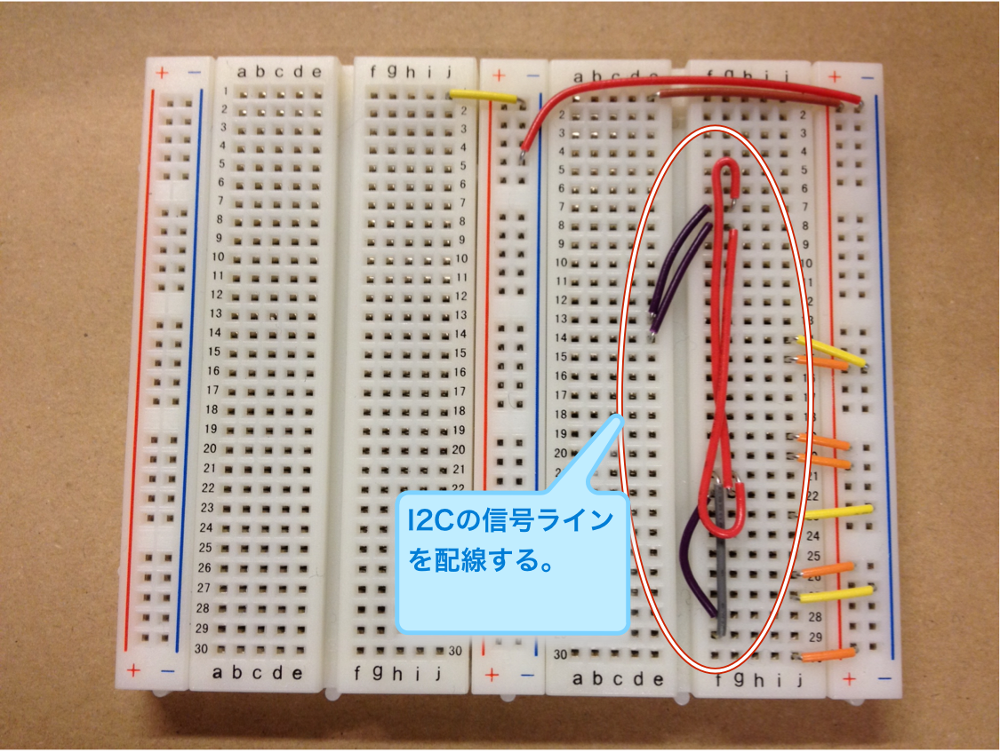
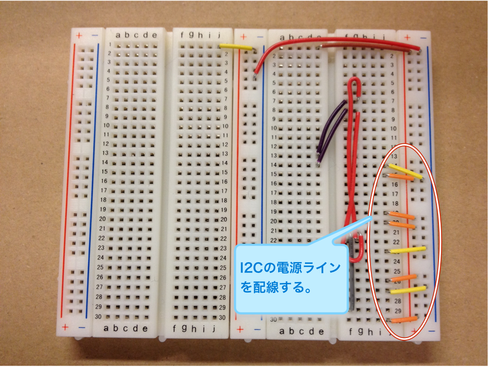
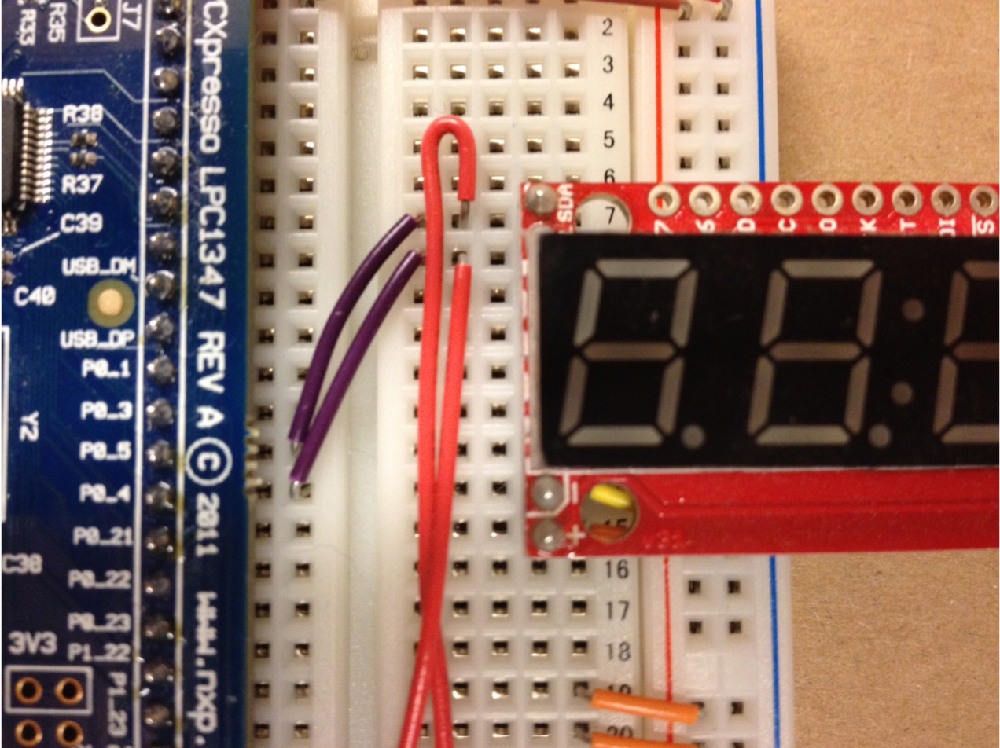
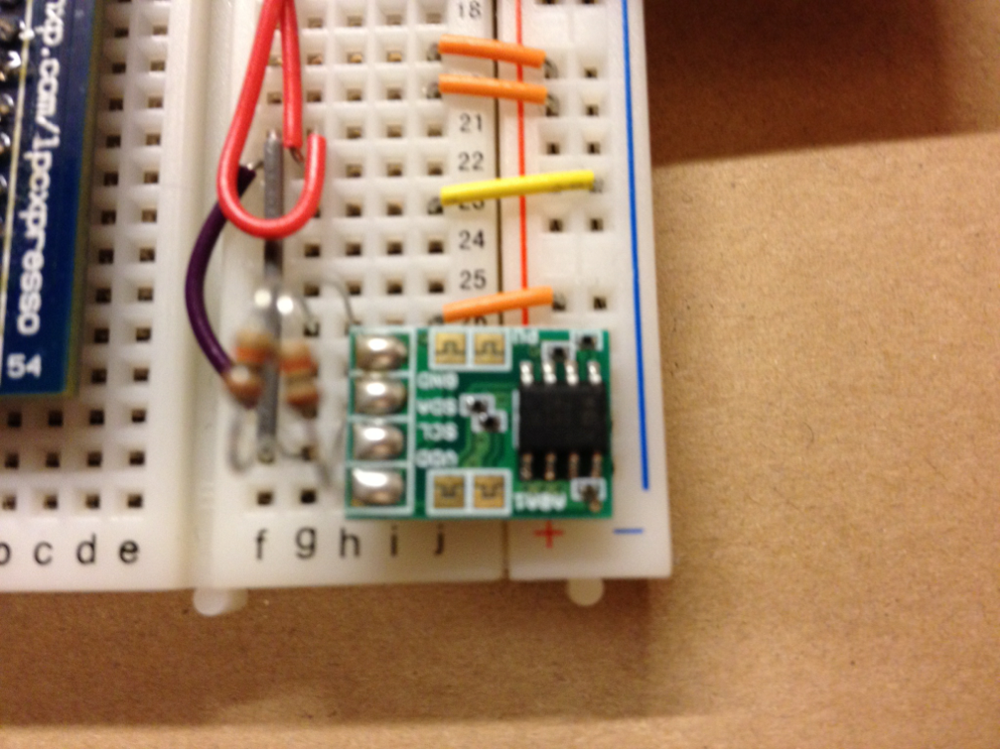
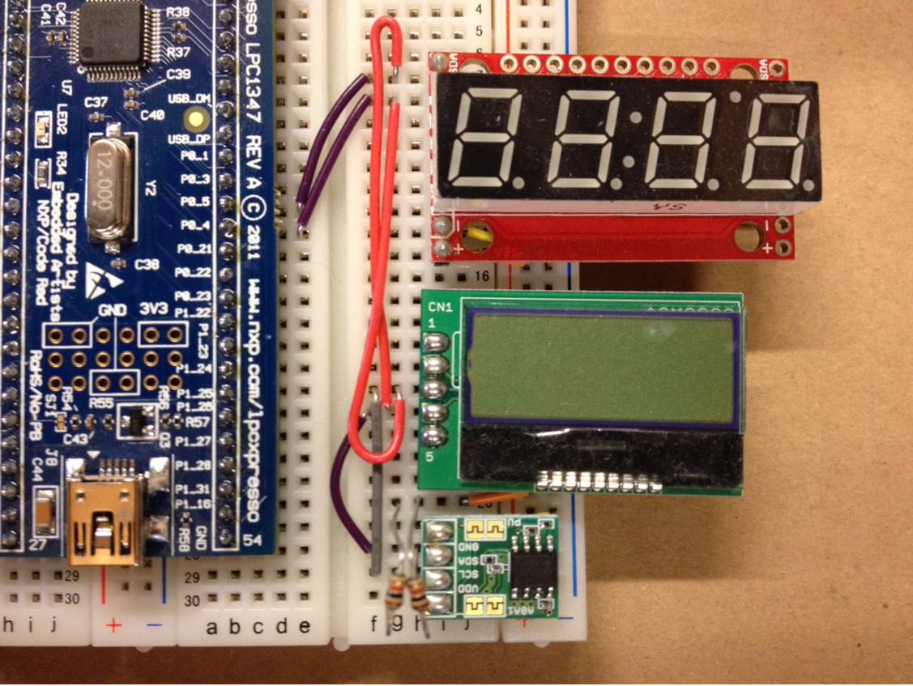

led1347-thermometer
===================

I2Cバスを用いて温度計を作ります。

## LEDと抵抗器を取り外す

lpc1347-led-tickerで使用したLEDと抵抗はもう使用しないので、取り外しておきます。

## I2Cバスラインの配線

下記の図に従って配線を行います。少し見づらいですが、後述する番号に従って配線してください。

LPC1347の`P0_5`がI2Cの`SDA`ラインで、`P0_4`が`SCL`ラインになっています。

- `f21`から`f29`
- `f22`から`f28`
- `g22`から`g7`
- `g21`から`g8`
- `e14`から`f8`
- `e13`から`f7`

下記の写真で配線状態を確認してください。

## I2Cデバイス用の電源の配線

次に電源を配線します。

- `j14`からマイナス
- `j15`からプラス
- `j19`からプラス
- `j20`からプラス
- `j23`からマイナス
- `j26`からプラス
- `j27`からマイナス
- `j30`からプラス

下記の写真で配線状態を確認してください。

## I2Cのプルアップ抵抗2本を配線

I2Cのバスはプラス電源にプルアップする必要があります。今回の回路では10kΩの抵抗器2個でプルアップします。抵抗器には茶黒橙金のカラーコードがついています。

- `g26`と`g29`
- `h26`と`h28`

抵抗器の長い足が他の部品に接触しないよう気をつけてください。必要であれば短く切ってから使用します。

## 空のプロジェクトを作成する

Lチカプログラムと同様に空のプロジェクトを作成してください。

## ボード上のLEDでLチカを動かす

動作確認という事で、ボード上の`LED2`とシルク印刷されたLEDを点滅させて見ます。下記のコミット内容を参考にコーディングしてください。GPIO周りやSysTick割り込み周りはlpc1347-led-tickerプロジェクトからコピーしてくると簡単です。基本的にはLEDのピン番号が異なるだけです。

- [評価ボード上のLED2(P0_7)を使ってLチカ](https://github.com/yhojo/lpc1347-thermometer/commit/060888651b24306468b568112b2c3f9501d613e7)

## 7セグメントLEDを追加する

ブレッドボードに7セグメントLEDを追加します。

7セグメントLEDの各ピンが下記の様に接続するようにします。

- `SDA`を`i7`
- `SCL`を`i8`
- `-`を`i14`
- `+`を`i15`

下記の写真を参考にして正しく挿せているか確認してください。

## 7セグメントLEDの動作確認、デバッグ

次に7セグメントLEDが動作するか、下記のコミットを参考にプログラムを修正してください。

I2Cを制御するライブラリの`i2c_master.h`と`i2c_master.c`は丸ごと追加なので、githubからファイルごとダウンロードして追加した方が良いでしょう。

- [7セグメントLEDをカウントアップ](https://github.com/yhojo/lpc1347-thermometer/commit/fb20f0fce8fba21b154bc7ab5ea749d63299a0da)

## 温度センサの追加

温度センサを追加します。シルク印刷の文字が上下逆になるので注意してください。

- `GND`を`i27`
- `SDA`を`i28`
- `SCL`を`i29`
- `VDD`を`i30`

下記の写真を参考に正しく刺せているか確認してください。

## 温度センサの値をLEDに表示する

では、温度センサから読み取った値をLEDに表示してみましょう。下記のコミットを参考にプログラムを修正します。

- [温度センサから読み込んだ値をそのまま7セグLEDに表示](https://github.com/yhojo/lpc1347-thermometer/commit/ae6ced2fb2c6cd29af23e0fd611d5f3a09d49202)

ここでの修正では、温度では無くセンサから読み取った数値をそのままLEDに表示しています。

## 計測頻度を高くする

このままでは計測値を1秒ごとに更新するという非常にゆっくりした動作なので、1/10秒ごとに更新するよう修正して見ます。

下記のコミットを参考に修正してください。

- [1/10秒ごとに温度値を更新するよう修正](https://github.com/yhojo/lpc1347-thermometer/commit/12cb93e7dd1e5ce2b9972ae439ccb76e234cf188)

## セ氏で正しく表示する

センサから読みとった数字だけでは、具体的に何度なのかわかりません。今回のセンサーではスペックシートにあるとおり16bitモードで0.0078度単位で温度を計測している事から下記のコミットを参考に修正して、1/100度の単位でLEDに表示されるよう修正します。

- [1/100の精度で温度を表示](https://github.com/yhojo/lpc1347-thermometer/commit/f503fdc2fcc83aa5f776af76e9069920b9f1e8de)

## LCDを追加する

いよいよLCDを追加します。ピンのシルク印刷が基板の裏側にあってわかりづらいですが、下記の様に挿します。

- `VDD`を`i19`
- `RESET`を`i20`
- `SCL`を`i21`
- `SDA`を`i22`
- `GND`を`i23`

下記の写真を参考に、正しく挿せたか確認してください。

## LCDにLEDと同じ内容を表示

LCDにLEDと同じ内容を表示します。下記のコミットを参考に修正してください。また、LCDを操作するライブラリの`st7032i.h`と`st7032i.c`はgithubから直接ダウンロードしてプロジェクトに追加してください。

- [LCDに1/100度単位の温度を4桁で表示](https://github.com/yhojo/lpc1347-thermometer/commit/6286050e30c9210a472017e5ff38692a0d08dfc7)

## LCDの表示内容を修正する

LCDは表示領域がLEDよりも広いので、もうすこしわかりやすい表示に修正して見ると良いかもしれません。下記のコミットを参考にするなどして修正して見てください。

- [LCDの表示周りを仕上げ](https://github.com/yhojo/lpc1347-thermometer/commit/b8ed304a20bf4973f593584a93ddb286bbf5acfa)
